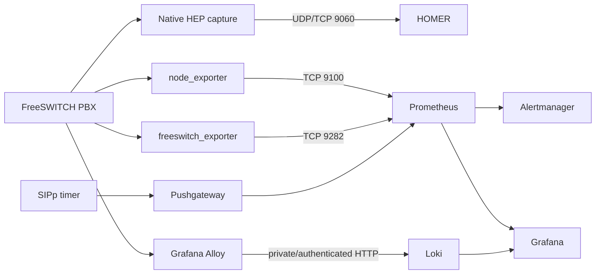

# Architecture

## Purpose and boundary

This is a single-node observability platform for one or more FreeSWITCH/PBX
servers. Monitoring traffic may be lost during a MON01 outage, but production
call processing must continue independently.

HOMER handles SIP capture and call-flow analysis. Grafana handles metrics and
logs. Prometheus evaluates alerts and sends them to Alertmanager. Synthetic SIP
results enter through Pushgateway.

## Central services

| Service | Image default | Function | Host bind | Persistence |
|---|---|---|---|---|
| HOMER | `ghcr.io/sipcapture/homer:11.0.333` | HEP ingest, SIP storage, query, UI | 9060 UDP/TCP on `HEP_BIND_ADDRESS`; 8080 on `UI_BIND_ADDRESS` | `homer_data` |
| Prometheus | `prom/prometheus:v3.14.0` | Scrapes metrics, evaluates rules | 9090 on `UI_BIND_ADDRESS` | `prometheus_data` |
| Alertmanager | `prom/alertmanager:v0.34.0` | Groups/routes alerts | 9093 on `UI_BIND_ADDRESS` | `alertmanager_data` |
| Loki | `grafana/loki:3.7.7` | Stores and queries logs | 3100 on `UI_BIND_ADDRESS` | `loki_data` |
| Grafana | `grafana/grafana:13.2.0` | Dashboards and exploration | 3000 on `UI_BIND_ADDRESS` | `grafana_data` |
| node_exporter | `prom/node-exporter:v1.12.1` | MON01 host metrics | Compose network only | none |
| Blackbox Exporter | `prom/blackbox-exporter:v0.28.0` | HTTP/TCP probes | Compose network only | none |
| Pushgateway | `prom/pushgateway:v1.11.3` | Receives synthetic check metrics | 9091 on `UI_BIND_ADDRESS` | `pushgateway_data` |
| volume-init | `alpine:3.20` | Corrects volume ownership before startup | none | accesses all volumes |

Image values are configurable in `.env`, but defaults are pinned for repeatable
upgrades. Avoid floating tags.

## Network exposure

`UI_BIND_ADDRESS` defaults to `127.0.0.1`, covering Grafana, HOMER UI,
Prometheus, Alertmanager, Loki, and Pushgateway. Access them using an SSH tunnel,
VPN, or authenticated TLS reverse proxy.

`HEP_BIND_ADDRESS` defaults to `0.0.0.0` because remote PBXs must send capture
traffic to MON01. Restrict UDP/TCP 9060 at the provider firewall, VPN boundary,
or Docker-aware host firewall.

See [Restrict HEP traffic](FIREWALL.md) for an example allowlist and its IPv6
and firewall-backend limitations.

Internal exporters communicate only on the Compose bridge network. The central
node_exporter mounts the host root read-only and uses the host PID namespace so
Prometheus can observe MON01.

PBX-side requirements:

- HEP: PBX to MON01 UDP 9060; TCP is also supported.
- node_exporter: MON01 to PBX TCP 9100.
- freeswitch_exporter: MON01 to PBX TCP 9282.
- ESL: local exporter to FreeSWITCH `127.0.0.1:8021`; never remotely exposed.
- Alloy to Loki: private/VPN or authenticated TLS HTTP route.

## Metrics and alert flow

Prometheus scrapes central services and four file-discovery inventories:

- `prometheus/targets/pbx-nodes.yml`
- `prometheus/targets/freeswitch.yml`
- `prometheus/targets/http-probes.yml`
- `prometheus/targets/tcp-probes.yml`

Tracked examples live in `prometheus/targets.example/`. The installer creates
local target files only when they are absent, so reruns preserve inventory.
Prometheus checks these files every minute.

Alert rules currently cover:

- central and PBX scrape failures;
- failed HTTP/TCP endpoint probes;
- failed or stale synthetic SIP checks;
- high CPU, CPU steal, low memory, low disk space, and I/O wait.

Alertmanager is wired to Prometheus but external delivery is intentionally
unconfigured.

## Logs

Loki uses a single-node filesystem backend and TSDB schema. Grafana is
provisioned with Loki and Prometheus data sources. PBXs ship only selected logs
through Alloy.

Loki authentication is disabled in the shipped single-node configuration. Its
HTTP endpoint must not be exposed directly to untrusted networks.

## SIP and RTP visibility

Native FreeSWITCH HEP capture sends SIP signaling to HOMER. HEP capture IDs are
unsigned numeric identifiers for physical FreeSWITCH nodes, not logical PBX or
redundant clusters. Current FS PBX systems assign them automatically starting at
`101`; each server in a redundant system still receives its own ID so HOMER can
distinguish the nodes.

The optional RTP capture is deliberately PBX-local. It records truncated packet
headers in a fixed-size ring and does not forward media to MON01. It is designed
for loss, jitter, sequence, timing, and addressing analysis—not audio playback.

## Persistence and retention

Named Docker volumes hold all central state. Default retention and sizing:

| Data | Default retention/limit | Planning allocation on a 300 GB host |
|---|---:|---:|
| HOMER SIP | 30 days | approximately 140 GB |
| Loki logs | 14 days | approximately 70 GB |
| Prometheus | 90 days and 40 GB maximum | approximately 40 GB |
| OS, Docker, reserve | n/a | approximately 50 GB |

Actual ingest depends on call volume, traffic duplication, and log verbosity.
Review usage after the first week. Docker container logs rotate at 20 MB with
three files per container.

Named volumes survive:

- container recreation;
- Docker daemon restart;
- host reboot;
- `docker compose down` without `--volumes`.

They are deleted by explicit volume-removal operations.

## Boot sequence

1. systemd starts containerd and Docker.
2. Docker restores existing containers according to `restart: unless-stopped`.
3. After Docker and `network-online.target`, `monitoring-reconcile.service`
   checks for `/opt/monitoring/compose.yaml` and `/opt/monitoring/.env`.
4. If both exist, it runs `docker compose up -d --remove-orphans` once.
5. The one-shot service exits; Docker continues supervising containers.

The reconciler also recreates the declared stack after a previous
`docker compose down`, as long as `.env` and the deployment files remain.

## Failure model

- MON01 down: visibility and alerting are reduced; calls continue.
- HOMER down: SIP capture/search is unavailable; calls continue.
- Prometheus or Alertmanager down: metric alerts are delayed or lost.
- Loki down: remote log delivery may back off or drop according to agent limits.
- PBX exporter down: only its monitoring target fails.
- HEP delivery blocked: HOMER loses capture; FreeSWITCH signaling continues.

No PBX should synchronously depend on a central monitoring response.

## Repository configuration layers

1. Tracked defaults: Compose, Prometheus, Loki, Grafana, and example files.
2. Local deployment configuration: `.env` and `prometheus/targets/*.yml`.
3. Persistent runtime state: named Docker volumes.
4. PBX-local configuration: systemd environments, FreeSWITCH snippets, and
   optional capture files.

Keeping these layers separate makes upgrades repeatable without committing
secrets or infrastructure inventory.
